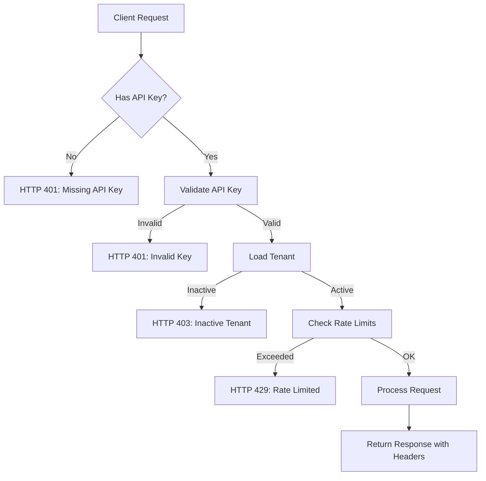

# Phase 4: Production Hardening

## Overview

Phase 4 transforms the RAG system into a production-ready, multi-tenant platform with enterprise features including tenant isolation, background processing, rate limiting, and comprehensive observability.

## Architecture

### Production Components

```
src/
├── tenants/              # Multi-tenant management
│   ├── models.py         # Tenant, APIKey, UsageStats models
│   ├── manager.py        # Tenant CRUD and API key management
│   └── auth.py           # Authentication middleware
├── workers/              # Background processing
│   ├── task_queue.py     # Async task queue
│   ├── document_worker.py # Document ingestion worker
│   └── indexing_worker.py # Vector indexing worker
└── api/
    ├── rate_limit.py     # Rate limiting middleware
    └── observability.py  # Metrics, logging, tracing
```

## Features

### 1. Multi-Tenant Architecture

**Tenant Management:**
- Tenant creation with configurable plans (free, pro, enterprise)
- Resource limits per plan (documents, queries/day)
- Tenant activation/deactivation
- Email-based identification

**API Key Management:**
- Secure API key generation (SHA-256 hashing)
- Per-key rate limiting configuration
- Key activation/revocation
- Last-used tracking

**Resource Isolation Strategies:**

**Collection-based isolation (recommended):**
```python
# Each tenant gets separate vector collection
tenant = manager.create_tenant(
    name="Acme Corp",
    email="admin@acme.com",
    isolation_mode="collection",  # Separate collection per tenant
)
# Collection name: tenant_<tenant_id>
```

**Filter-based isolation:**
```python
# Shared collection with metadata filtering
tenant = manager.create_tenant(
    name="Beta Inc",
    email="admin@beta.com",
    isolation_mode="filter",  # Shared collection + filters
)
# Queries filtered by tenant_id metadata
```

**Implementation:**

```python
from src.tenants import TenantManager

# Create manager
manager = TenantManager()

# Create tenant
tenant = manager.create_tenant(
    name="Enterprise Corp",
    email="admin@enterprise.com",
    plan="enterprise",
)

# Generate API key
api_key, raw_key = manager.create_api_key(
    tenant_id=tenant.id,
    name="Production Key",
    rate_limit_per_minute=200,
)

print(f"API Key: {raw_key}")
# Save this key securely - it won't be shown again!

# Validate key
validated = manager.validate_api_key(raw_key)
if validated:
    print(f"Valid key for tenant: {validated.tenant_id}")

# Get tenant's collection
collection_name = manager.get_collection_name(tenant.id)
```

### 2. Background Workers

**Task Queue System:**
- Async task processing with asyncio
- Multiple concurrent workers
- Task status tracking (pending, running, completed, failed)
- Progress reporting (0-100%)
- Persistent storage

**Supported Tasks:**

**Document Ingestion:**
```python
from src.workers import get_task_queue, create_document_worker

queue = get_task_queue()
doc_worker = create_document_worker()

# Register handler
queue.register_handler("ingest_document", doc_worker.ingest_document)

# Submit task
task = queue.submit_task(
    task_type="ingest_document",
    tenant_id=tenant.id,
    data={
        "file_path": "./data/document.pdf",
        "doc_type": "pdf",
        "metadata": {"source": "upload"},
    }
)

# Check status
task = queue.get_task(task.id)
print(f"Status: {task.status}")
print(f"Progress: {task.progress}%")
```

**Batch Ingestion:**
```python
task = queue.submit_task(
    task_type="ingest_batch",
    tenant_id=tenant.id,
    data={
        "files": ["doc1.pdf", "doc2.txt", "doc3.docx"],
        "doc_types": ["pdf", "text", "word"],
    }
)
```

**Vector Indexing:**
```python
from src.workers import create_indexing_worker

index_worker = create_indexing_worker()
queue.register_handler("index_documents", index_worker.index_documents)

task = queue.submit_task(
    task_type="index_documents",
    tenant_id=tenant.id,
    data={
        "documents": [{"text": "...", "metadata": {}}],
    }
)
```

**Worker Pool:**
```python
# Start workers
await queue.start_worker(num_workers=4)

# Workers process tasks concurrently
# Stop when done
queue.stop_worker()
```

### 3. Rate Limiting

**Multi-Level Limits:**
- Per minute
- Per hour
- Per day
- Configurable per API key

**Implementation:**

```python
from src.api.rate_limit import RateLimiter, RateLimitMiddleware

# Create limiter
limiter = RateLimiter()

# Check if allowed
allowed, retry_after = limiter.is_allowed(
    key="api_key_hash",
    limit=60,
    window_seconds=60,
)

if not allowed:
    print(f"Rate limited! Retry after {retry_after}s")

# Get usage stats
usage = limiter.get_usage("api_key_hash", window_seconds=60)
print(f"Requests: {usage['requests']}")
```

**FastAPI Middleware:**
```python
from fastapi import FastAPI
from src.api.rate_limit import RateLimitMiddleware

app = FastAPI()
app.add_middleware(RateLimitMiddleware)

# Responses include rate limit headers:
# X-RateLimit-Limit-Minute: 60
# X-RateLimit-Remaining-Minute: 45
# X-RateLimit-Limit-Hour: 1000
# X-RateLimit-Remaining-Hour: 850
```

**Rate Limit Response:**
```json
{
  "detail": "Rate limit exceeded. Try again in 42 seconds."
}
```
Headers:
- `HTTP 429 Too Many Requests`
- `Retry-After: 42`

### 4. Observability

**Metrics Collection:**

```python
from src.api.observability import get_metrics_collector

metrics = get_metrics_collector()

# Increment counters
metrics.increment("requests_total")
metrics.increment("requests_by_tenant", tenant_id="tenant-123")
metrics.increment("cache_hits")

# Record timing
metrics.record_response_time(duration_ms=145.5)

# Get current metrics
current = metrics.get_metrics()
print(f"Total requests: {current['requests_total']}")
print(f"Avg response time: {current['avg_response_time_ms']}ms")
```

**Available Metrics:**
- `requests_total` - Total API requests
- `requests_by_tenant` - Requests per tenant
- `errors_total` - Total errors
- `cache_hits` / `cache_misses` - Cache performance
- `avg_response_time_ms` - Average response time
- `llm_calls` - LLM API calls
- `embeddings_generated` - Embedding generations
- `documents_indexed` - Documents indexed
- `retrieval_calls` - Retrieval operations

**Structured Logging:**

```python
from src.api.observability import StructuredLogger

logger = StructuredLogger("my_module")

# Log with context
logger.info(
    "Query processed successfully",
    tenant_id="tenant-123",
    query_length=50,
    duration_ms=145,
    cache_hit=True,
)

logger.error(
    "Query failed",
    tenant_id="tenant-456",
    error="Timeout",
    duration_ms=5000,
)
```

**Output (JSON):**
```json
{
  "message": "Query processed successfully",
  "tenant_id": "tenant-123",
  "query_length": 50,
  "duration_ms": 145,
  "cache_hit": true,
  "timestamp": "2025-12-20T10:30:45Z"
}
```

**LangSmith Tracing:**

```python
from src.api.observability import get_tracer

tracer = get_tracer(enabled=True)

# Trace chain execution
with tracer.trace_chain("rag_pipeline", {"query": "What is RAG?"}):
    # Chain logic here
    pass

# Trace LLM calls
with tracer.trace_llm("gemini-1.5-flash", prompt):
    # LLM call here
    pass
```

**Function Tracing Decorator:**

```python
from src.api.observability import trace_function

@trace_function("process_query")
async def process_query(query: str):
    # Automatically traced
    return await rag_pipeline.query(query)
```

### 5. Authentication Flow



**API Usage:**

```bash
# With Bearer token
curl -X POST "http://localhost:8000/query" \
  -H "Authorization: Bearer rag_xxxxxxxxxxxxx" \
  -d '{"query": "What is RAG?"}'

# With X-API-Key header
curl -X POST "http://localhost:8000/query" \
  -H "X-API-Key: rag_xxxxxxxxxxxxx" \
  -d '{"query": "What is RAG?"}'
```

## Configuration

### Environment Variables (.env)

```bash
# Production mode
ENVIRONMENT=prod

# Multi-tenant settings
ENABLE_MULTI_TENANT=true

# Rate limiting (defaults)
DEFAULT_RATE_LIMIT_PER_MINUTE=60
DEFAULT_RATE_LIMIT_PER_HOUR=1000
DEFAULT_RATE_LIMIT_PER_DAY=10000

# Observability
ENABLE_LANGSMITH_TRACING=true
LANGSMITH_API_KEY=your_langsmith_key
METRICS_ENABLED=true

# Worker settings
WORKER_POOL_SIZE=4
TASK_STORAGE_PATH=./data/tasks.json

# Tenant storage
TENANT_STORAGE_PATH=./data/tenants.json
```

## Production Deployment

### Prerequisites

1. **Infrastructure:**
   - Load balancer (NGINX, AWS ALB)
   - Multiple API server instances
   - Redis for distributed caching and rate limiting
   - PostgreSQL for tenant/task storage
   - Qdrant Cloud for vector storage

2. **Monitoring:**
   - LangSmith account for tracing
   - Prometheus + Grafana for metrics
   - ELK stack for log aggregation

### Deployment Steps

**1. Configure Environment:**
```bash
# Copy and configure .env
cp .env.example .env
nano .env

# Set production values
ENVIRONMENT=prod
VECTOR_DB=qdrant
QDRANT_URL=https://your-cluster.qdrant.io
ENABLE_MULTI_TENANT=true
```

**2. Initialize Infrastructure:**
```bash
# Start Redis
docker run -d -p 6379:6379 redis:latest

# Start PostgreSQL
docker run -d -p 5432:5432 \
  -e POSTGRES_PASSWORD=yourpassword \
  postgres:15
```

**3. Start Worker Pool:**
```python
# workers_server.py
import asyncio
from src.workers import get_task_queue, create_document_worker, create_indexing_worker

async def main():
    queue = get_task_queue()
    
    # Register handlers
    doc_worker = create_document_worker()
    index_worker = create_indexing_worker()
    
    queue.register_handler("ingest_document", doc_worker.ingest_document)
    queue.register_handler("ingest_batch", doc_worker.ingest_batch)
    queue.register_handler("index_documents", index_worker.index_documents)
    
    # Start workers
    await queue.start_worker(num_workers=4)

if __name__ == "__main__":
    asyncio.run(main())
```

**4. Start API Servers:**
```bash
# Server 1
gunicorn src.api.app:app \
  --workers 4 \
  --worker-class uvicorn.workers.UvicornWorker \
  --bind 0.0.0.0:8000

# Server 2 (different port)
gunicorn src.api.app:app \
  --workers 4 \
  --worker-class uvicorn.workers.UvicornWorker \
  --bind 0.0.0.0:8001
```

**5. Configure Load Balancer (NGINX):**
```nginx
upstream rag_api {
    server localhost:8000;
    server localhost:8001;
}

server {
    listen 80;
    server_name api.yourcompany.com;
    
    location / {
        proxy_pass http://rag_api;
        proxy_set_header Host $host;
        proxy_set_header X-Real-IP $remote_addr;
    }
}
```

## Testing

### Tenant Management Demo

```bash
python scripts/tenant_demo.py
```

Tests:
- Tenant creation
- API key generation
- Background task submission
- Rate limiting
- Observability features

### Load Testing

```bash
python scripts/load_test.py
```

Tests:
- Concurrent requests
- Rate limit enforcement
- Multi-tenant isolation
- Performance under load

## Best Practices

### 1. Security

- **API Keys:**  
  ✓ Store hashed keys only  
  ✓ Rotate keys regularly  
  ✓ Use HTTPS in production  
  ✓ Implement key expiration

- **Tenant Isolation:**  
  ✓ Validate tenant_id in all operations  
  ✓ Use separate collections for sensitive data  
  ✓ Audit cross-tenant access attempts

### 2. Performance

- **Caching:**  
  ✓ Enable embedding cache (Redis)  
  ✓ Enable response cache  
  ✓ Use CDN for static assets  
  ✓ Cache API responses at edge

- **Scaling:**  
  ✓ Horizontal scaling (multiple API servers)  
  ✓ Vertical scaling (larger instances)  
  ✓ Database read replicas  
  ✓ Vector store sharding

### 3. Reliability

- **Error Handling:**  
  ✓ Graceful degradation  
  ✓ Circuit breakers for external services  
  ✓ Retry logic with exponential backoff  
  ✓ Comprehensive error logging

- **Monitoring:**  
  ✓ Health check endpoints  
  ✓ Metrics dashboards  
  ✓ Alert on error rate spikes  
  ✓ Track P95/P99 latencies

### 4. Cost Optimization

- **Resource Management:**  
  ✓ Implement query quotas  
  ✓ Archive inactive tenants  
  ✓ Clean up old cache entries  
  ✓ Optimize embedding batch size

- **LLM Costs:**  
  ✓ Aggressive response caching  
  ✓ Prompt optimization  
  ✓ Use cheaper models when appropriate  
  ✓ Implement token budgets

## Monitoring Dashboard

### Key Metrics to Track

1. **System Health:**
   - API uptime (99.9%+ target)
   - Error rate (<1% target)
   - Average response time (<200ms target)
   - P95 response time (<500ms target)

2. **Business Metrics:**
   - Active tenants
   - Queries per day
   - Documents indexed
   - Cache hit rate (>80% target)

3. **Resource Utilization:**
   - CPU usage
   - Memory usage
   - Disk usage
   - Network bandwidth

4. **Cost Metrics:**
   - LLM API costs
   - Vector DB costs
   - Infrastructure costs
   - Cost per query

## Troubleshooting

### Common Issues

**1. Rate Limiting Not Working:**
```python
# Check if middleware is registered
from src.api.rate_limit import RateLimitMiddleware
app.add_middleware(RateLimitMiddleware)

# Verify API key configuration
api_key = manager.validate_api_key(raw_key)
print(f"Rate limit: {api_key.rate_limit_per_minute}/min")
```

**2. Background Tasks Not Processing:**
```python
# Check worker status
queue = get_task_queue()
print(f"Running: {queue.running}")
print(f"Handlers: {list(queue.handlers.keys())}")

# Check pending tasks
pending = queue.list_tasks(status=TaskStatus.PENDING)
print(f"Pending tasks: {len(pending)}")
```

**3. Tenant Isolation Issues:**
```python
# Verify collection name
collection = manager.get_collection_name(tenant_id)
print(f"Collection: {collection}")

# Check isolation mode
tenant = manager.get_tenant(tenant_id)
print(f"Isolation mode: {tenant.isolation_mode}")
```

## Migration Guide

### From Phase 3 to Phase 4

**1. Add Multi-Tenant Support:**
```python
# Before (global access)
from src.rag import create_rag_pipeline
pipeline = create_rag_pipeline()
response = pipeline.query("What is RAG?")

# After (tenant-specific)
from src.tenants import get_tenant_manager
manager = get_tenant_manager()
tenant = manager.get_tenant_by_api_key(api_key)
collection = manager.get_collection_name(tenant.id)

# Use tenant-specific collection
pipeline = create_rag_pipeline(collection_name=collection)
response = pipeline.query("What is RAG?")
```

**2. Enable Rate Limiting:**
```python
# Add to app.py
from src.api.rate_limit import RateLimitMiddleware

app.add_middleware(RateLimitMiddleware)
```

**3. Add Authentication:**
```python
# Protect endpoints
from src.tenants.auth import get_current_tenant

@app.post("/query")
async def query(
    request: QueryRequest,
    tenant: Tenant = Depends(get_current_tenant),
):
    # tenant is authenticated
    pass
```

## Files Created (Phase 4)

- `src/tenants/models.py` - Tenant and API key models
- `src/tenants/manager.py` - Tenant management
- `src/tenants/auth.py` - Authentication middleware
- `src/workers/task_queue.py` - Background task queue
- `src/workers/document_worker.py` - Document ingestion worker
- `src/workers/indexing_worker.py` - Vector indexing worker
- `src/api/rate_limit.py` - Rate limiting middleware
- `src/api/observability.py` - Metrics, logging, tracing
- `scripts/tenant_demo.py` - Multi-tenant demo
- `scripts/load_test.py` - Load testing script
- `docs/phase4.md` - This documentation

## Next Steps (Post-Phase 4)

**Production Enhancements:**
1. Redis-based distributed rate limiting
2. PostgreSQL for tenant/task persistence
3. Kubernetes deployment configs
4. CI/CD pipeline setup
5. Automated backup system
6. Disaster recovery plan
7. Multi-region deployment
8. Advanced analytics dashboard

**Feature Additions:**
1. Usage-based billing integration
2. Webhook notifications
3. Real-time collaboration
4. Advanced admin dashboard
5. Audit logging
6. Compliance certifications (SOC 2, GDPR)

The RAG system is now production-ready with enterprise-grade features! 🚀
